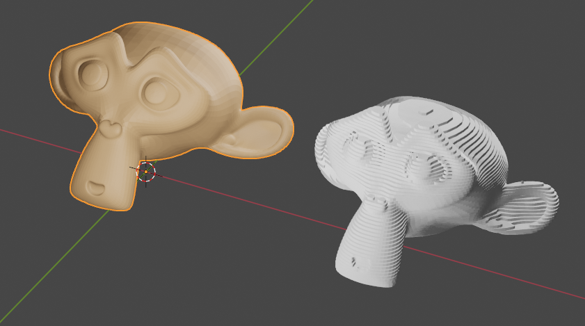
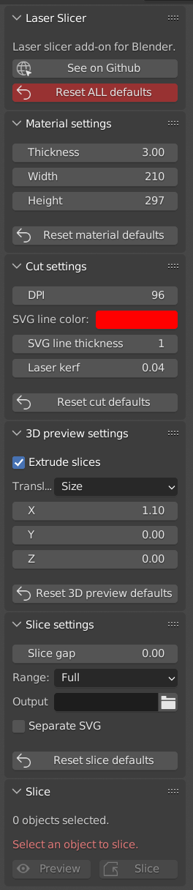

# laser_slicer

Laser slicer add-on for Blender.

## Description

The Laser Slicer cuts up a Blender object and exports the slices to `SVG` files for cutting on a laser cutter or other post-processing.

This project is a fork of the [laser_slicer](https://github.com/rgsouthall/laser_slicer) repo from [Ryan Southall](https://github.com/rgsouthall), thank you so much Ryan !!.

The intention of the fork is to:

* Reorganize the code as per my personal preferences.
* Add features I find useful for my personal workflow.

## Setup

* Either:
  * Download the [zip file of the add-on](https://github.com/clvLabs/laser_slicer/archive/refs/heads/master.zip).
  * Extract it in your `~/.config/blender/<VERSION>/scripts/addons` folder (or equivalent).
* or:
  * Clone this project in your `~/.config/blender/<VERSION>/scripts/addons` folder (or equivalent).
* Open Blender.
* Go to `Edit > Preferences > Add-ons`.
* Refresh the list.
* Activate the `Laser Slicer` add-on.
* A new `Laser` tab will appear in `View3D > Sidebar`.

## Usage

* Select the object you want to slice.
* Activate the side panel with `n`.
* Select the `Laser` tab.
* Adjust your settings.
* Click the `Preview` button.
* A new `LaserSlices` object will be created.
* Tweak the settings until you like what you see.
* Every time you click on `Preview` the `LaserSlices` object will be regenerated.
* Click the `Slice` button. This time it will taka a little longer.
* The `LaserSlices` object will be regenerated.
* The `SVG` file(s) will be saved.

A tutorial video of the original project (not including this project's extra features) can be found at [Ryan's blog](https://blendscript.blogspot.com/2019/01/blender-28-laser-slicer.html).

## Configuration

Settings are separated by sections:

* `Material settings`.
* `Cut settings`.
* `3D Preview settings`.
* `Slice settings`.

All of these sections have a `Reset defaults` button to restore _factory settings_ for that section.

There's also a `Reset ALL defaults` button in the `Laser Slicer` (about) section.

Settings sections can be collapsed so only the settings you often change are visible. If you always use the same kind of material you can have the `Material settings` section collapsed.

### Material settings

* `Thickness`: Thickness of the material to be cut, used to calculate slice height.
* `Width`: Width of the material sheet being cut, used to generate the `SVG` file.
* `Height`: Height of the material sheet being cut, used to generate the `SVG` file.

### Cut settings

* `DPI`: Resolution of the generated `SVG` file.
* `SVG line color`: Color of the generated `SVG`lines.
* `SVG line thickness`: Thickness of the generated `SVG`lines.
* `Laser kerf`: The width of the laser beam (See [Definition of kerf in Wikipedia](https://en.wikipedia.org/wiki/Saw#Terminology)).

### 3D preview settings

* `Extrude slices`: If active, generated slices will be extruded for previewing purposes.
* `Translate mode`: How to move the resulting preview 3D slices to compare with original.
  * `None`: Generated object stays at the same position as source object.
  * `Distance`: Specify X/Y/Z distance from source in scene units.
    * `X/Y/Z`: Distance (in scene units) from original object.
  * `Size`: Specify X/Y/Z distance from source in object size units.
    * `X/Y/Z`: Distance (in object size units) from original object.

* `Translate preview`: Move the resulting preview 3D slices to compare with original.

### Slice settings

* `Slice gap`: Leave an extra gap between slices (maybe to add spacers later).
* `Range`: Select the vertical range of the object to slice (allows partial slicing).
* `Output`: Name of the `SVG` file to be generated.
* `Separate SVG`: If selected, separated `SVG` files will be created for slices.
  * `Position`: When `Separate SVG` is selected the position of the slice in the `SVG` file can be specified.
